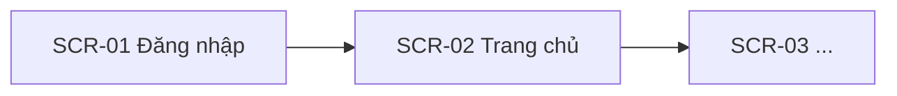

# FSD — Đặc tả chức năng theo màn hình — <Tên dự án / module>

| Phiên bản | v0.1 | Ngày | <yyyy-mm-dd> | Trạng thái | DRAFT |
|-----------|------|------|--------------|------------|-------|

> **Cách dùng file này:** copy ra `docs/ba/FSD.md` (kiểu B microservices: `docs/<service-name>/FSD.md`) rồi
> điền. Các khối `> 💡 Hướng dẫn` và `> 📝 Ví dụ` là chỉ dẫn — **xóa khi hoàn thiện**. Markdown suốt dự án.
>
> **Ranh giới với SRS (quan trọng):** SRS là nguồn sự thật về **YÊU CẦU** (FR, quy tắc nghiệp vụ, validate
> mức dữ liệu, tiêu chí chấp nhận). FSD đặc tả **HÀNH VI TRÊN MÀN HÌNH** của các FR đó: element, tương tác,
> điều hướng, trạng thái UI, ánh xạ sang API. FSD **tham chiếu FR-ID, không chép lại** quy tắc; nếu phát
> hiện mâu thuẫn → **SRS thắng**, phải cập nhật SRS (qua PO) trước rồi mới sửa FSD.
>
> **Bảng phân công — cái gì viết ở đâu (chống trùng lặp):**
>
> | Nội dung | Viết ở SRS | Viết ở FSD |
> |----------|:----------:|:----------:|
> | Luồng nghiệp vụ (hệ thống xử lý gì, C/R/U/D thực thể) | ✅ | ❌ chỉ ghi `bám FR-xx` |
> | Quy tắc nghiệp vụ, công thức, bảng trạng thái đối tượng | ✅ | ❌ tham chiếu BR-xx |
> | Validate dữ liệu (kiểu, định dạng, miền giá trị) | ✅ | ❌ tham chiếu bảng validate FR-xx |
> | Thao tác trên UI (bấm gì, màn hình đổi ra sao, gọi API nào, điều hướng đâu) | ❌ | ✅ |
> | Element, ẩn/disable theo quyền; 4 trạng thái UI | ❌ | ✅ |
> | errorCode → thông điệp hiển thị trên UI | ❌ (SRS chỉ có mã lỗi) | ✅ |
> | Ma trận FR ↔ màn hình ↔ API ↔ dữ liệu | ❌ | ✅ |
>
> **Phép thử nhanh:** một dòng không nhắc tới màn hình/element/API/điều hướng → nó thuộc SRS, không thuộc FSD.

## 1. Giới thiệu
Mục đích, phạm vi (link SRS đã duyệt + design.md), thuật ngữ. Danh sách FR được phủ trong FSD này.

## 2. Bản đồ chức năng & màn hình

> 💡 Liệt kê mọi màn hình, gắn mã `SCR-xx`; vẽ sơ đồ điều hướng (Mermaid) để thấy đường đi của người dùng.

| Mã màn hình | Tên màn hình | Chức năng phủ (FR) | Vai trò được truy cập |
|-------------|--------------|--------------------|------------------------|
| SCR-01 | | FR-01, FR-02 | |

## 3. Đặc tả từng màn hình *(khối lặp cho mỗi SCR-xx)*

> 💡 **Viết đến mức frontend/mobile code được, tester bấm theo được.** Mỗi màn hình trả lời đủ:
> (1) có những element nào, (2) mỗi element hành xử ra sao (kể cả disable/ẩn theo quyền/điều kiện),
> (3) bấm gì gọi API nào, (4) màn hình trông thế nào khi loading / empty / lỗi / thành công.

### SCR-01 — <Tên màn hình> *(phủ FR-xx)*
- **Wireframe:** <link/ảnh từ `design.md`> · **Tiền điều kiện vào màn:** <đăng nhập? quyền? trạng thái?>
- **Bảng element:**
  | # | Element | Loại | Hành vi / điều kiện hiển thị·enable | Nguồn dữ liệu / API | Validate hiển thị (ref SRS) | Thông báo trên UI |
  |---|---------|------|--------------------------------------|---------------------|------------------------------|--------------------|
  | 1 | | button/input/list… | | | FR-xx bảng validate | |
- **Luồng thao tác trên màn hình (UI flow)** — *mở đầu bằng `bám FR-xx`*:

  > 💡 **Chống lai với SRS:** bảng này chỉ tả **cái nhìn thấy trên UI** — bấm gì, màn hình đổi ra sao, gọi
  > endpoint nào, điều hướng đi đâu. **KHÔNG** chép lại xử lý nghiệp vụ/C-R-U-D từ luồng chính của SRS —
  > phần đó đã có ở FR-xx; ở đây chỉ ghi `bám FR-xx bước n` khi cần đối chiếu.

  | # | Người dùng thao tác | Màn hình phản hồi | API gọi (endpoint) | Điều hướng |
  |---|---------------------|-------------------|--------------------|------------|
  | 1 | | | | |
- **Luồng thay thế / ngoại lệ trên UI:** *(đánh số gắn bước; ánh xạ mã lỗi API → thông điệp hiển thị)*
  - 2a. <điều kiện / errorCode> → <UI hiển thị gì, người dùng làm gì tiếp>
- **Trạng thái UI:** Loading <skeleton/spinner…> · Empty <thông điệp + hành động gợi ý> · Lỗi <retry?> ·
  Thành công <toast/điều hướng>.
- **Phân quyền hiển thị:** vai trò nào thấy/bấm được gì (ẩn hay disable — ghi rõ).

> 📝 **Ví dụ điền sẵn — SCR-05 Đăng ký gói cước** *(phủ FR-02 của SRS mẫu)*
> - **Bảng element (trích):**
>   | # | Element | Loại | Hành vi / điều kiện | Nguồn dữ liệu / API | Validate (ref SRS) | Thông báo trên UI |
>   |---|---------|------|----------------------|---------------------|--------------------|--------------------|
>   | 1 | Danh sách gói | list | Chỉ hiện gói đang mở bán; refresh khi kéo xuống | GET /packages | — | — |
>   | 2 | Nút "Đăng ký" | button | Disable khi chưa chọn gói | — | — | — |
>   | 3 | Hộp xác nhận | dialog | Hiện giá + hạn gói trước khi trừ tiền | — | — | — |
> - **Luồng tương tác chính:** 1· Chọn gói → highlight, enable nút | 2· Bấm "Đăng ký" → gọi
>   POST /subscriptions → hiện dialog xác nhận | 3· Bấm "Xác nhận" → trừ tiền, toast "Đăng ký thành công",
>   điều hướng SCR-02.
> - **Ngoại lệ UI:** 3a. errorCode `SB201` (số dư không đủ) → dialog "Số dư không đủ…" + nút "Nạp tiền"
>   (điều hướng SCR-09) — bám luồng 1a của FR-02, **không chép lại quy tắc**, chỉ tả cách hiển thị.
> - **Trạng thái UI:** Loading: skeleton 3 dòng · Empty: "Chưa có gói khả dụng" · Lỗi mạng: nút "Thử lại".

## 4. Ma trận ánh xạ FR ↔ Màn hình ↔ API ↔ Dữ liệu

> 💡 Ma trận này là **giá trị cốt lõi của FSD** — nơi duy nhất nhìn thấy một FR chạy xuyên suốt từ UI
> tới API tới dữ liệu. Tester dùng cột này để phủ test; dev dùng để biết đủ việc chưa.

| FR (SRS) | Màn hình (SCR) | API (api-spec) | Bảng/thực thể dữ liệu | Ghi chú |
|----------|----------------|----------------|------------------------|---------|
| FR-02 | SCR-05 | POST /subscriptions | TaiKhoan, DangKyGoi | |

## 5. Báo cáo / đầu ra *(nếu có)*
Mỗi báo cáo: layout cột (tên, nguồn dữ liệu, công thức, định dạng), bộ lọc, quyền xem, xuất file (định dạng, giới hạn dòng).

## 6. Truy vết & thay đổi
- Mọi mục trong FSD truy vết về **FR-ID của SRS đã duyệt**; không tự thêm hành vi ngoài SRS.
- Mâu thuẫn với SRS → dừng, báo PO cập nhật SRS trước (SRS thắng). Thay đổi sau GATE-3 → đi theo Luồng
  Change Request của `WORKFLOW.md`.

---

## ✅ Checklist FSD (trước khi báo PO trình GATE-3)
- [ ] Mọi màn hình có mã `SCR-xx`; sơ đồ điều hướng phủ hết đường đi chính.
- [ ] Mỗi màn hình: đủ bảng element (kể cả điều kiện ẩn/disable theo quyền), luồng tương tác, ngoại lệ UI.
- [ ] Mọi mã lỗi API dùng trên UI có **thông điệp hiển thị** cụ thể (ánh xạ errorCode → message).
- [ ] Đủ 4 trạng thái UI (loading/empty/lỗi/thành công) cho màn hình có dữ liệu động.
- [ ] **Ma trận FR ↔ SCR ↔ API ↔ dữ liệu** phủ 100% FR trong phạm vi; không FR nào mồ côi.
- [ ] Không chép lại quy tắc nghiệp vụ từ SRS (chỉ tham chiếu FR-ID/BR-ID); không mâu thuẫn SRS.
- [ ] Khớp `design.md` (wireframe/token) và `api-spec.md` (endpoint có thật); không PII thật (PDPL).
- [ ] Đã xóa hết khối 💡 Hướng dẫn / 📝 Ví dụ.
