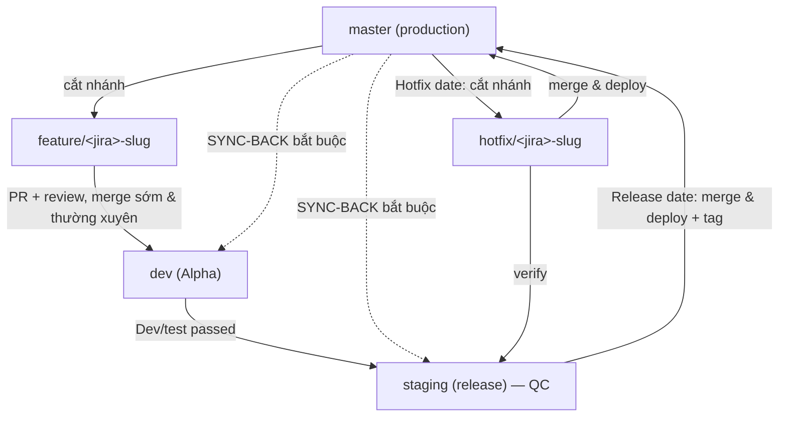

# SOURCE CONTROL — Mô hình nhánh & quy ước quản lý mã nguồn (Thức SDLC Kit)

> Chuẩn dùng chung cho **toàn đội dev: backend, frontend (fe), mobile**. Mọi skill dev tham chiếu file này;
> gắn với `WORKFLOW.md` (B3/B4 và Luồng R). Mục tiêu: mã nguồn nhất quán, dễ theo dõi, **giảm đau khi gom
> merge lúc deploy**.

## 1. Mô hình 5 nhánh (GitFlow)

| Nhánh | Vai trò | Cắt từ | Bảo vệ |
|-------|---------|--------|:------:|
| `master` (**= production**) | Code chạy thật; luôn sạch & mới nhất | — | **Protected** |
| `staging` (**= release**) | Pre-production + QC (đóng vai trò release) | dev | **Protected** |
| `dev` (**Alpha**) | Nhánh tích hợp — nơi dev merge SR, chạy dev/test | master | — |
| `feature/*` | Mỗi SR/feature một nhánh, làm ở Local | **master** | — |
| `hotfix/*` | Vá lỗi gấp trên production | **master** | — |

**Nguyên tắc cốt lõi:** feature **cắt từ `master`** ⇒ `master` phải luôn mới nhất ⇒ **sau mỗi lần lên
production PHẢI sync ngược về `dev` + `staging` + `master`** để 3 nhánh đồng nhất. Bỏ bước sync-back là
nguyên nhân số 1 gây trôi nhánh & xung đột về sau.

## 2. Quy ước đặt tên nhánh *(bắt buộc — để dễ theo dõi)*

- **Feature:** `feature/<mã Jira>-<mô-tả-ngắn>` → ví dụ `feature/SR-1234-nap-tien`.
- **Hotfix:** `hotfix/<mã>-<mô-tả-ngắn>` → ví dụ `hotfix/INC-88-loi-dang-nhap`.
- **Cố định:** `master`, `staging`, `dev` (không đổi tên, không tạo trùng vai trò).
- Quy tắc slug: chữ thường, nối bằng gạch `-`, không dấu tiếng Việt, **luôn có mã Jira** để truy vết ngược
  về SR/ticket.

## 3. Quy ước commit

- Mẫu: `<type>(<scope>): <mô tả> — ref <mã Jira>`
- `type`: `feat` | `fix` | `refactor` | `test` | `docs` | `chore`.
- Ví dụ: `feat(nap-tien): thêm validate số dư tối thiểu — ref SR-1234`.
- Commit **nhỏ, một mục đích**; thông điệp rõ ràng; **gắn mã Jira**. Không commit secret/PII (PDPL).

## 4. Luồng làm việc (promotion)

1. **Cắt nhánh** `feature/*` (hoặc `hotfix/*`) **từ `master`**.
2. Dev làm ở Local; **đồng bộ `master` mới nhất vào nhánh định kỳ** (rebase/merge) để bắt xung đột sớm.
3. **Merge lên `dev` qua PR + code review** → chạy Dev/test.
4. Đạt Dev/test → merge `dev` → `staging` → **QC** (release).
5. **Release date:** `staging` → `master` (production), **gắn tag/version** (khớp Luồng R của WORKFLOW).
6. **Sync-back bắt buộc:** ngay sau khi lên production, đồng bộ về `dev` + `staging` + `master`.
7. **Hotfix:** cắt `hotfix/*` từ `master` → verify ở `staging` → lên `master` → **sync-back** như bước 6.

## 5. Làm song song & giảm "khổ merge lúc deploy" ⚠️ *(điểm mấu chốt)*

Nhiều dev chạy nhiều feature **song song** ⇒ xung đột dồn lại khi gom deploy. Kỷ luật để giảm đau:

- **Feature nhỏ, vòng đời ngắn** — tránh nhánh sống dai hàng tuần.
- **Merge lên `dev` sớm và thường xuyên** (tích hợp liên tục), **không dồn tới sát release**.
- **Đồng bộ `master` vào feature định kỳ** (hằng ngày nếu có thể) → resolve xung đột từng chút, không để
  bùng nổ lúc deploy.
- **Chủ feature tự resolve conflict** ngay trên nhánh của mình, không đẩy cục xung đột cho người deploy.
- **PR nhỏ, review nhanh, CI chạy build + test trên mỗi PR** → phát hiện lỗi tích hợp trước khi lên dev.

## 6. Cổng & bảo vệ nhánh

- `master` và `staging` **protected**: chỉ vào qua **PR đã review + CI xanh**; **cấm push thẳng**.
- **Tag/version** mỗi lần lên production.
- **Sync-back** là **checkpoint bắt buộc** sau mỗi lần production (kể cả hotfix) — nên tự động hoá.

## 7. Gắn với WORKFLOW

- **B3/B4:** dev làm trên `feature/*`, merge lên `dev` qua PR (review bắt buộc).
- **GATE-4:** code vào qua PR đã review + CI xanh; feature đã merge `dev`, Dev/test đạt.
- **Luồng R (Release):** gắn tag; sau deploy → **sync-back** `dev` + `staging` + `master`.

## ✅ Checklist mỗi dev trước khi merge

- [ ] Nhánh đúng quy ước: `feature/<jira>-<slug>` hoặc `hotfix/<jira>-<slug>`.
- [ ] Đã đồng bộ `master` mới nhất vào nhánh và **resolve hết conflict** ở nhánh mình.
- [ ] Commit rõ ràng, đúng mẫu, **gắn mã Jira**.
- [ ] PR nhỏ, có mô tả, **CI xanh**, có **người review**.
- [ ] Không commit secret/PII (PDPL).
- [ ] (Sau production) đã **sync-back** về `dev` + `staging` + `master`.
